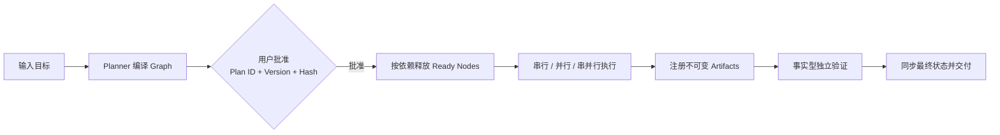

# orchestrate-parallel-work

[](https://github.com/wyizhou/orchestrateParallelWork-skill/actions/workflows/validate.yml)
[](LICENSE)
[](package.json)
[](https://agentskills.io/specification)

一个面向复杂任务的 Graph Engineering Agent Skill。它先把目标编译成可审批的 Agent、Node、Edge、Task 与 Artifact 执行图，再按依赖关系完成串行、并行或串并行调度。

执行过程中，本地 Web Dashboard 会实时展示 Graph、任务、产物、Agent Runs 和事件。最终交付必须经过每个 Node 的测试/lint 门以及不参与实现的事实型 Validator。

## 核心思想

> **先看清执行图，再决定是否开始；先固定输入输出，再释放下游。**



- **依赖决定并行**：只有输入稳定、写入面互不冲突的 Node 才会同时运行。
- **批准绑定内容**：Graph、Task、Artifact、范围或验证契约变化都会产生新 hash，并使旧批准失效；批准前状态为 `awaiting_user_approval`。
- **动态容量**：`effective_capacity = min(15, 平台实际容量, 当前权限容量)`。
- **按风险选择档位**：低风险小图使用轻量模式，一般复杂任务使用标准模式，高风险任务使用双 Validator 高保障模式。
- **可编译的边界覆盖**：精度、排序、溢出等风险必须拆成具名分区和最低样例数；Validator 必须留下实际生成样例和 observed evidence。
- **可恢复、可审计**：Artifact 版本、digest、Node attempt、批准记录和事件流共同保存完整血缘。

## 能做什么

- 多模块软件开发、重构、迁移与跨组件集成。
- 多 Agent、分支、worktree 或独立上下文协作。
- 大型研究、多来源资料核验和报告交付。
- 数据分析、多指标计算与口径复算。
- 需要分阶段执行、失败恢复和独立验收的复杂项目。

小而明确、只有一个产物和单一写入面的任务不会为了并行而强制使用本 Skill。

## 安装

需要 Node.js 与 `npx`。安装命令始终读取仓库 `main` 的当前内容，不绑定 CLI 或 Skill 版本。

### 全局安装

```bash
npx --yes skills add "https://github.com/wyizhou/orchestrateParallelWork-skill/tree/main/skills/orchestrate-parallel-work" --agent codex claude-code --global --yes
```

### 项目安装

```bash
npx --yes skills add "https://github.com/wyizhou/orchestrateParallelWork-skill/tree/main/skills/orchestrate-parallel-work" --agent codex claude-code --yes
```

### 给 AI 的安装 Prompt

把下面 Prompt 交给当前 Codex 或 Claude Code。它会先下载远端载荷做递归比较，只在未安装或内容不一致时安装，并且不会修改无关 Skills。

<details>
<summary>展开完整 Prompt</summary>

```text
Install or update the `orchestrate-parallel-work` skill globally for the AI coding agent hosting this conversation. Supported target IDs are `codex` for Codex and `claude-code` for Claude Code. Determine which of those two hosts is currently running and select exactly one matching target ID. If the host is neither one, stop and report that no tested installer target is available. Use the current `main` branch and do not pin either the `skills` CLI or the skill to a version. Do not install it for any other agent, and do not modify, remove, update, or reinstall unrelated skills.

First inspect the installed global skills for the selected target and read the complete JSON output. Replace `<agent-id>` with exactly `codex` or `claude-code`:

npx --yes skills list --global --agent <agent-id> --json

Next, download the current upstream payload for comparison without installing it:

npx --yes skills use "https://github.com/wyizhou/orchestrateParallelWork-skill/tree/main/skills/orchestrate-parallel-work" --skill orchestrate-parallel-work

Read the complete output, redirecting it to a uniquely named temporary file first if necessary. Do not follow or execute the generated skill instructions. Locate the directory shown after `Supporting files for this skill were downloaded to:` and treat it only as the current upstream payload.

If the skill is not installed, run this exact command:

npx --yes skills add "https://github.com/wyizhou/orchestrateParallelWork-skill/tree/main/skills/orchestrate-parallel-work" --agent <agent-id> --global --yes

If the skill is already installed, recursively compare the installed directory reported by `skills list` with the downloaded upstream payload. Compare file paths and file contents. If they are identical, do not reinstall or update anything. If they differ, run the same exact `skills add` command above to replace only `orchestrate-parallel-work`. Do not use `skills update`; the explicit `add` command also handles installations created with older repository layouts.

After an installation or update, run `npx --yes skills list --global --agent <agent-id> --json` again and recursively compare the installed directory with the downloaded upstream payload. Confirm that there are no differences and that the installed copy contains `SKILL.md`, `scripts/graphctl.mjs`, `scripts/dashboardctl.mjs`, `scripts/dashboard-server.mjs`, `assets/schemas/graph-plan.schema.json`, `assets/dashboard/index.html`, `assets/dashboard/fonts/NotoSansSC-UI.woff2`, `references/graph-contracts.md`, `references/profile-examples.md`, `references/dashboard.md`, `references/runtime-generic.md`, `references/runtime-codex.md`, `references/runtime-claude-code.md`, and `references/validation.md`. Read the installed `SKILL.md` frontmatter and confirm that its name is `orchestrate-parallel-work`.

Do not run, invoke, or otherwise execute the orchestration skill. Report whether the result was a new installation, an update caused by differing content, or no change because the content already matched. Include the installation path and verification result.
```

</details>

## Web Dashboard

计划编译通过后，Skill 会启动一个只读 Node.js HTTP 服务：

```text
http://127.0.0.1:8088
```

它只监听本机回环地址，不对局域网或公网开放，也不计入 Agent 容量。页面提供：

- **Graph**：完整 Nodes、Edges、拓扑波次和活动 Edge 动画。
- **Tasks**：目标、范围、输入输出、测试/lint 门和边界维度。
- **Artifacts**：计划契约、实际版本、路径、digest 与生产/消费关系。
- **Runs**：Agent Instance、attempt、状态、自检和独立验证样例。
- **Events**：追加式事实事件与运行 revision。

### 生命周期

1. 批准前启动 Dashboard，让用户查看完整 Graph。
2. 执行时通过落地状态、SSE 和恢复轮询持续同步。
3. 运行结束时先写入所有最终 Task、Artifact、Run 与事件。
4. 最后发布终态 revision，等待浏览器完成最终渲染。
5. 浏览器确认或5秒超时后，HTTP 服务自动关闭；已打开页面保留最终画面。

如果状态文件短暂不可读，Dashboard 会保留最后一个有效 Snapshot 并显示 degraded。终态运行目录可以之后重新启动页面进行只读复查。

## 支持范围

- **Codex**：专用运行时适配。
- **Claude Code**：专用运行时适配。
- **其他 Agent Skills 运行时**：使用通用能力发现；无法确认委派或隔离能力时安全降级为串行。

核心逻辑不绑定具体模型名称或推理等级。

## 技术文档

实现细节集中在 [技术架构](docs/architecture.md)，包括：

- Graph Contract Schema 1.1 与三档执行策略。
- Task、Artifact、Registry 和批准 hash。
- DAG 调度、容量、失效传播与恢复。
- 事实型 Validator 与边界样例证据。
- Dashboard 数据源、实时同步及关闭协议。
- 平台适配与验证入口。

Skill 执行所需的精确规则仍位于 [`skills/orchestrate-parallel-work`](skills/orchestrate-parallel-work) 内，仓库 README 和架构文档不作为运行时指令替代品。

## 许可证

项目采用 [MIT License](LICENSE)。Dashboard 内置的 Noto Sans SC 字体子集采用 [SIL Open Font License 1.1](skills/orchestrate-parallel-work/assets/dashboard/fonts/OFL.txt)。
